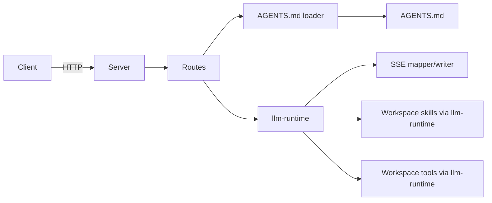

# Plan: ai-workspace-scaffold

## Goal

Scaffold a minimal but runnable Node.js + TypeScript HTTP/SSE server that loads workspace `AGENTS.md` on each request, appends it to the default system prompt used by `llm-runtime`, delegates tool and skill support to `llm-runtime`, and packages cleanly for local and Docker execution.

## Constraints

- Keep the system stateless.
- Do not add multi-agent behavior, durable storage, relay logic, or database dependencies.
- Do not shell out to `agent-cli`.
- Use the real `llm-runtime` package rather than a mock runtime for the main execution path.
- Do not recreate tool wrappers or skill discovery logic that `llm-runtime` already provides.
- Append `AGENTS.md` to the runtime's default system prompt rather than replacing it.

## Architecture Outline

## Design Decisions

- Use Express for straightforward HTTP routing and streaming response handling.
- Use small modules with explicit types instead of framework abstractions.
- Use the actual `llm-runtime` package as the only runtime/tool/skill engine.
- Do not maintain a server-owned parallel tool registry or skill parser.
- Load `AGENTS.md` from the workspace root and append it to the default system prompt supplied by `llm-runtime`.
- Treat OpenAI-style JSON compatibility as secondary to the internal runtime event model.
- Use one runtime event stream for both SSE and non-stream responses so response modes cannot diverge semantically.

## E2E Coverage Decision

E2E coverage is required because the scaffold exposes user-facing API behavior and SSE streaming that must be validated across the assembled server stack. The test spec will cover health checks, non-stream JSON completion behavior, streaming event behavior, `AGENTS.md` prompt influence, and runtime-backed workspace tool or skill behavior.

## Phased Tasks

- [x] Inspect relevant files
- [x] Make focused changes
- [x] Run validation
- [x] Update docs/status

## Implementation Steps

### Phase 1: Project scaffold

- Create `package.json`, `tsconfig.json`, `.gitignore`, `.env.example`, `.dockerignore`, and `Dockerfile`.
- Add TypeScript build, dev, and start scripts.
- Add the dependencies needed for Express-based HTTP/SSE delivery, TypeScript development, and direct `llm-runtime` integration.
- Keep the environment contract centered on generic `LLM_*` runtime defaults instead of bespoke tool-toggle flags or provider-specific default-model variables.

### Phase 2: Server and routing

- Add server bootstrap and Express app wiring.
- Implement `GET /health`.
- Implement `POST /chat/completions` and alias `POST /chat`.
- Add placeholder request verification middleware.

### Phase 3: Workspace loading

- Resolve the effective workspace root from environment.
- Load `AGENTS.md` when present.
- Append `AGENTS.md` content to the default system prompt provided by `llm-runtime`.

### Phase 4: llm-runtime integration

- Inspect the `llm-runtime` package API and initialize it directly.
- Pass the effective workspace root into `llm-runtime` so workspace tools and skills are provided by the runtime itself.
- Remove or avoid any server-local tool registry, skill scanner, or mock runtime path that duplicates `llm-runtime` behavior.
- Map `LLM_PROVIDER`, `LLM_MODEL`, `LLM_MAXTOKEN`, `LLM_TEMPERATURE`, `LLM_PERMISSION`, and `LLM_REASONING` into runtime defaults used when request values are absent.

### Phase 5: Runtime and streaming

- Define runtime request and event types.
- Implement runtime invocation that forwards request messages into `llm-runtime` and maps runtime events back to the HTTP response layer.
- Emit runtime events for message deltas, tool calls/results when used, final message completion, and errors.
- Map runtime events to SSE output and aggregate non-stream responses.

### Phase 6: Documentation and packaging

- Write a concise README covering scope, workspace layout, runtime behavior, tooling, local usage, and Docker usage.
- Ensure the Docker image builds the app and runs the compiled server against `/workspace`.

## Validation Plan

- Run `npm install`.
- Run `npm run build`.
- Run `npm run dev`.
- Verify `GET /health` with `curl`.
- Verify streaming `/chat/completions` with `curl -N`.
- Verify non-stream `/chat/completions` JSON aggregation with `curl`.
- Verify that `AGENTS.md` content affects runtime behavior by being appended to the default system prompt.
- Verify that workspace skill or tool behavior comes from `llm-runtime`, not server-local wrappers.
- Verify that `LLM_*` environment defaults are applied when request-level values are omitted.
- Verify startup and request handling without provider API keys configured.
- Run `docker build -t ai-workspace .`.

## Risks And Mitigations

- Unknown `llm-runtime` initialization details: mitigate by inspecting the package API before wiring the runtime layer.
- Accidentally replacing, rather than appending to, the default runtime system prompt: mitigate with a focused integration check using `AGENTS.md`.
- Reintroducing server-local tool or skill logic by habit: mitigate by deleting or avoiding parallel tool and skill modules entirely.
- Drifting into an overly specific environment contract: mitigate by standardizing on generic `LLM_*` defaults for runtime behavior.
- SSE regressions: mitigate with explicit event mapping and an E2E scenario for streaming output.
- Missing workspace assets: mitigate with tolerant loaders that return empty context rather than crashing.

## Status

- Updated by a follow-up environment-contract change.
- Replaced bespoke env toggles and provider-specific default-model vars with generic `LLM_*` runtime defaults.
- Verified that health output reflects `LLM_PROVIDER`, `LLM_MODEL`, `LLM_MAXTOKEN`, `LLM_TEMPERATURE`, `LLM_PERMISSION`, and `LLM_REASONING`.
- Verified that the server still starts and returns a clear provider-configuration error when credentials are missing.
- Added local `.env` loading through `dotenv` for development while keeping Docker runtime env injection unchanged.
- Added Azure OpenAI provider support through `LLM_PROVIDER=azure` plus Azure-specific credential variables.
- VR follow-up: refreshed stale RPD docs that still described the old mock runtime and server-owned tool layer.