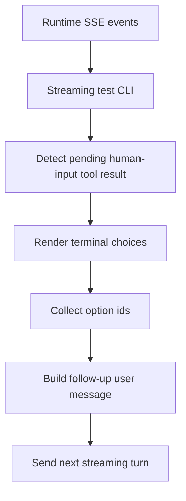

# Plan: testing-cli-ask-user-question-tool-call

## Goal

Add lightweight human-input handling to the interactive streaming test CLI so `ask_user_input`, `human_intervention_request`, and local `ask_user_question` alias events can become structured terminal prompts and follow-up user messages.

## Constraints

- Keep the CLI dependency-free.
- Avoid server-side session/state ownership for this developer utility.
- Preserve the existing streaming request flow and in-memory history model.
- Keep changes focused on the CLI, tests, and documentation unless runtime types need a narrow compatibility update.

## Architecture Outline

## Design Decisions

- Treat the `llm-runtime` pending HITL artifact as the source of truth because the server already executes tools internally.
- Support `ask_user_input` and `human_intervention_request`, plus a local compatibility alias for `ask_user_question` when older prompts use that name.
- Store pending human-input requests in the stream turn result so the outer CLI loop can ask questions after the stream finishes.
- Resume by sending a clear user message with selected ids and labels, because the stateless HTTP client does not own the original assistant tool-call message needed for a formal tool-role response.
- Keep answer selection parsing in pure helpers for unit coverage.

## E2E Coverage Decision

Dedicated E2E coverage is not required. This is a terminal test utility behavior, and focused unit tests plus the existing server streaming coverage are sufficient.

## Phased Tasks

- [x] Inspect relevant files
- [x] Make focused changes
- [x] Run validation
- [x] Update docs/status

## Implementation Steps

### Phase 1: Detection and types

- Add CLI-local types for pending human-input requests, questions, options, and selected answers.
- Parse `tool.result` events for pending HITL artifacts.
- Recognize `ask_user_input`, `human_intervention_request`, and `ask_user_question` as human-input tool names.

### Phase 2: Prompt and answer helpers

- Render questions and options in a plain terminal format.
- Parse single-select and multiple-select answers by number or option id.
- Allow empty answers only for skippable prompts.
- Convert selections into a deterministic follow-up user message.

### Phase 3: CLI integration

- Return pending human-input requests from `streamAssistantTurn`.
- Prompt for answers after a turn when pending requests exist.
- Send the generated answer message as the next turn and skip auto-continue while pending human input is being handled.

### Phase 4: Validation and docs

- Add focused unit tests.
- Update README CLI documentation.
- Run targeted unit tests and build.

## Risks And Mitigations

- The server cannot resume as a formal tool-role response because it owns tool execution internally. Mitigate by sending a structured user follow-up that carries the selected ids and labels.
- Invalid model-generated prompt shapes could be noisy. Mitigate by only prompting for validated pending artifacts from the runtime tool result.
- Multiple pending requests in one stream could confuse the user. Mitigate by processing them in stream order and building one consolidated follow-up message.

## Status

- Initial plan created for RPD execution.
- Implemented human-input request detection for streamed tool calls and pending HITL tool results.
- Added terminal answer collection for single-select, multiple-select, and skippable prompts.
- Added self-contained follow-up user messages with question text, question ids, option ids, and labels.
- Forwarded tool-call ids through runtime tool events and tool execution context.
- Added unit coverage for parsing pending requests, the `ask_user_question` alias, selection parsing, and answer-message formatting.
- Updated README CLI usage notes and verified with `npm run build` and `npm test`.
