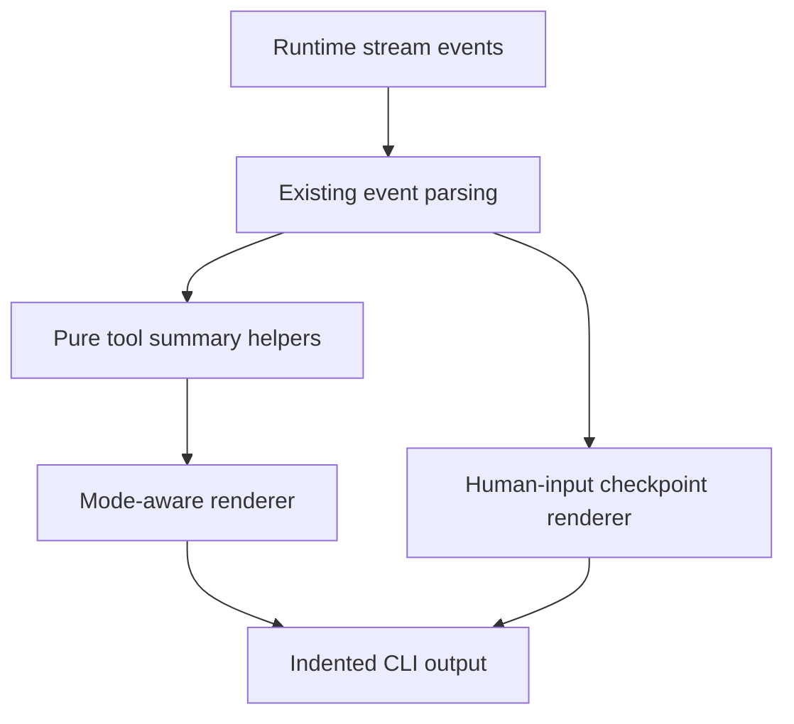

# Plan: testing-cli-compact-tool-traces

## Goal

Replace raw tool event dumping in the streaming test CLI with a small, pure rendering layer that supports compact, verbose, and debug trace modes without changing the underlying agent loop.

## Constraints

- Keep the change dependency-light and local to the CLI renderer and tests.
- Preserve current request, SSE, tool execution, and auto-continue behavior.
- Keep summarization helpers pure and avoid mutating tool payloads.
- Preserve raw event visibility in debug mode.

## Architecture Outline

## Design Decisions

- Keep trace summarization inside the CLI module unless a separate file becomes necessary for testability; the implementation should follow the smallest extraction that keeps the helpers pure.
- Extend CLI options with a trace mode so rendering stays configurable while the streaming loop and history model stay unchanged.
- Keep debug mode on the existing raw formatter path so runtime troubleshooting still has a direct escape hatch.
- Use tool-specific summarizers for `shell_cmd`, `search_files`, `read_file`, and `write_file`, with compact fallbacks for unknown tools.
- Reuse the existing human-input detection, but render those prompts through a dedicated checkpoint formatter instead of the generic tool trace formatter.

## Architecture Review

No major flaws found with the local rendering-only approach.

Tradeoffs considered:

- A separate renderer module improves isolation, but a local extraction inside the CLI file may be sufficient if it keeps the public surface small and testable.
- Parsing duration from raw tool payloads is useful for summaries, but the renderer must tolerate missing duration data because not every tool result carries it.
- Keeping debug mode aligned with current output minimizes risk and satisfies the requirement to preserve raw event-style visibility.

## E2E Coverage Decision

Dedicated E2E coverage is not required. This change is a local developer CLI presentation change, and focused unit coverage plus a build are sufficient.

## Phased Tasks

- [x] Inspect relevant files
- [x] Make focused changes
- [x] Run validation
- [x] Update docs/status

## Implementation Steps

### Phase 1: Trace mode plumbing

- Extend CLI option parsing with `traceMode`, `--verbose`, and `--debug`.
- Thread the selected mode into the stream rendering path without changing runtime behavior.

### Phase 2: Pure summarizers and renderers

- Add pure helper types and functions for tool call and result summaries.
- Implement compact truncation, preview extraction, error summarization, and file-size formatting helpers.
- Add tool-specific handling for `shell_cmd`, `search_files`, `read_file`, and `write_file`.

### Phase 3: Human-input checkpoint rendering

- Keep suppressing generic trace lines for structured human-input tools.
- Add a dedicated checkpoint formatter so pending human-input prompts render clearly in the CLI.

### Phase 4: Validation and closeout

- Add focused unit tests for default, verbose, and debug renderers.
- Run the streaming CLI unit tests and TypeScript build.
- Update plan status and completion docs after implementation and verification.

## Risks And Mitigations

- Tool payloads vary by runtime and provider. Mitigate with tolerant record parsing and sensible fallbacks.
- Overly aggressive truncation could hide useful details. Mitigate with verbose mode and small preview windows.
- Human-input tool events already have custom suppression logic. Mitigate by layering a dedicated renderer on top of the existing detection rather than changing the detection rules.

## Status

- Initial plan created for RPD execution.
- Added a dedicated `toolTraceRenderer` module with compact, verbose, and debug modes.
- Threaded `traceMode` through CLI option parsing and the streamed tool event writer without changing the agent loop.
- Replaced raw default tool dumps with compact summaries and bounded previews for shell and common file tools.
- Rendered structured human-input prompts as explicit `assistant needs input` checkpoints instead of generic tool traces.
- Added unit coverage for trace modes, summaries, debug rendering, and the human-input checkpoint flow.
- Verified with `npm run test:unit -- tests/unit/streamingTestCli.test.ts` and `npm run build`.