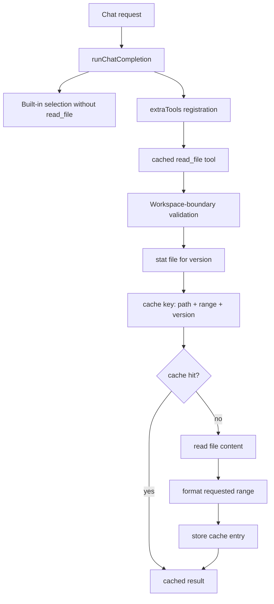

# Plan: cached-read-file-tool

## Goal

Replace the delegated built-in `read_file` tool with a host-owned file-reading tool that safely reuses repeated reads through cache entries keyed by resolved file path, requested range, and file version.

## Constraints

- Preserve the existing runtime behavior for other built-in tools.
- Keep file reads restricted to the resolved workspace root for the active request.
- Make cache correctness depend on file version so edits invalidate prior results.
- Keep the implementation small and local to runtime wiring, the new tool, and focused tests.
- Avoid E2E additions unless implementation work reveals a user-facing regression risk.

## Architecture Outline

## Design Decisions

- Replace only the `read_file` built-in path and keep the rest of the built-in tool selection unchanged.
- Implement the new tool as a host-owned tool in `src/tools/` so caching and path validation stay under server control.
- Use the resolved absolute file path, requested range, and detected file version as the cache identity.
- Detect file version from filesystem metadata first so repeated reads can reuse results without hashing full file contents on every call.
- Scope cache storage to the server process, but make cache keys specific enough to remain correct across concurrent users and requests.
- Use a non-reserved host-owned tool name if needed because llm-runtime reserves built-in names even when they are disabled.

## E2E Coverage Decision

Dedicated E2E coverage is not required. This is an internal runtime integration with deterministic behavior better covered by focused unit and targeted tests plus a TypeScript build.

## Phased Tasks

- [x] Inspect relevant files
- [x] Make focused changes
- [x] Run validation
- [x] Update docs/status

## Implementation Steps

### Phase 1: Tool contract and cache strategy

- Inspect the current runtime built-in selection and host-owned tool registration path.
- Define the host-owned `read_file` schema to preserve the current model-facing contract closely.
- Define the cache entry shape and file-version inputs used to invalidate stale entries.

### Phase 2: File-read execution

- Implement workspace-boundary checks and path normalization for the requested file.
- Read and format file contents for the requested range.
- Reuse prior results when the same resolved path, range, and file version are requested again.
- Return clear errors for invalid paths, invalid ranges, missing files, or unreadable files.

### Phase 3: Runtime wiring

- Disable the delegated built-in `read_file` tool in the runtime built-in selection.
- Register the host-owned cached file-read tool via `extraTools` during per-request runtime creation using a non-reserved name.
- Ensure the tool receives the active request workspace root so multi-user requests stay isolated by resolved path.

### Phase 4: Validation and status

- Add focused tests for cache hits, cache misses, invalidation on file change, and workspace-boundary enforcement.
- Add or update runtime tests to verify the built-in `read_file` is disabled and the host-owned tool is registered.
- Run targeted tests and a TypeScript build.
- Update plan status after implementation and validation complete.

## Risks And Mitigations

- Filesystem metadata alone can be ambiguous on some filesystems. Mitigate by including size and modification time in the file-version identity and only using that identity after a fresh stat.
- Tool-schema mismatch could break existing prompt behavior. Mitigate by preserving the `read_file` name and a close argument/result contract.
- Process-wide caching can leak incorrect results if keys are underspecified. Mitigate by keying on resolved absolute path plus range and file version.
- Large-file reads could consume memory if cached unboundedly. Mitigate by keeping the initial cache simple and bounded to exact read results rather than whole-file preloading.

## Status

- Initial plan created for RPD execution.
- AR passed: no blocking architecture flaws.
- No dedicated E2E spec is required for this internal runtime change.
- Added a host-owned cached workspace read tool in `src/tools/readFileTool.ts` with workspace-boundary checks and cache keys based on resolved path, requested range, and file version.
- Disabled the delegated built-in `read_file` in runtime built-ins and registered the host-owned custom read tool during per-request runtime creation while preserving optional `api_request` registration.
- Added focused unit coverage for cache hits, invalidation on file change, workspace-boundary enforcement, missing-file errors, and request tool registration.
- Verified with `node --import tsx --test tests/unit/readFileTool.test.ts tests/unit/runChatCompletion.test.ts tests/unit/runtimeConfig.test.ts`, `npm run build`, and `npm run test:unit`.