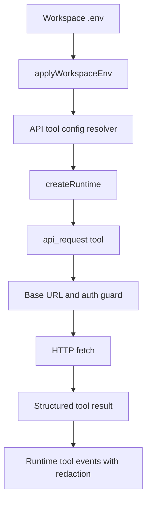

# Plan: llm-api-tool

## Goal

Register a workspace-configured API tool during per-request LLM runtime creation so the model can call approved HTTP endpoints through a constrained host surface that applies base URL and security credentials automatically.

## Constraints

- Keep runtime orchestration generic and avoid hard-coding one downstream product API.
- Reuse the existing workspace-root `.env` loading model rather than adding a second credential store.
- Prevent configured secrets from appearing in observable tool-call or tool-result events.
- Keep the integration narrow: runtime creation, tool implementation, focused tests, and minimal documentation updates.

## Architecture Outline

## Design Decisions

- Resolve API tool configuration from environment variables after workspace env application so every request uses the active workspace root.
- Register a single generic API tool with a predictable schema for method, path, query, headers, and optional JSON or text body.
- Constrain outbound requests to a configured base URL by resolving relative paths against the base and rejecting origin escapes.
- Apply auth from host configuration, not model-supplied arguments, so the model never needs raw access tokens.
- Return structured response metadata and parsed body content when possible, while preserving a safe raw text fallback.

## E2E Coverage Decision

Dedicated E2E coverage is not required. This change is a runtime integration that can be verified deterministically with focused unit tests and the existing TypeScript build.

## Phased Tasks

- [x] Inspect relevant files
- [x] Make focused changes
- [x] Run validation
- [x] Update docs/status

## Implementation Steps

### Phase 1: Configuration and tool surface

- Inspect runtime creation and tool registration paths.
- Add a small resolver for API tool configuration sourced from workspace-loaded env vars.
- Define the API tool schema and structured result shape.

### Phase 2: Request execution and guardrails

- Implement request URL resolution relative to the configured base URL.
- Attach configured auth and security headers automatically.
- Reject missing configuration, unsupported methods if needed, and base-URL escape attempts.
- Sanitize response data before it is surfaced through runtime events.

### Phase 3: Runtime wiring

- Register the API tool during `createRuntime(...)` for each request.
- Ensure runtime event payloads do not expose configured secrets.
- Keep existing runtime behavior unchanged when the API tool is not configured.

### Phase 4: Validation and docs

- Add focused unit tests for config loading, request construction, base-URL restriction, and redaction behavior.
- Update docs where runtime environment configuration is described.
- Run targeted tests and a TypeScript build.

## Risks And Mitigations

- Relative-path handling can accidentally permit origin escapes. Mitigate by validating the resolved URL origin and normalized base path.
- Response bodies may contain echoed credentials. Mitigate by reusing secret-redaction helpers on observable tool results.
- Missing or partial workspace configuration could break otherwise valid requests. Mitigate by failing closed with explicit configuration errors.

## Status

- Initial plan created for RPD execution.
- AR passed: no blocking architecture flaws.
- Registered a workspace-configured `api_request` tool per chat request via `extraTools` on the runtime completion call.
- Moved the tool implementation into `src/tools/apiRequestTool.ts` so tool ownership is separate from runtime orchestration.
- Added guards for base-URL origin and base-path confinement plus host-owned auth and security-context headers from workspace env.
- Reused request-scoped env snapshots for runtime tool redaction so configured API secrets stay out of observable tool events.
- Added unit coverage for API tool config detection, request construction, base-path rejection, and security-context redaction.
- Verified with focused API tool tests, `npm run test:unit`, `npm run build`, and `git --no-pager diff --check`.