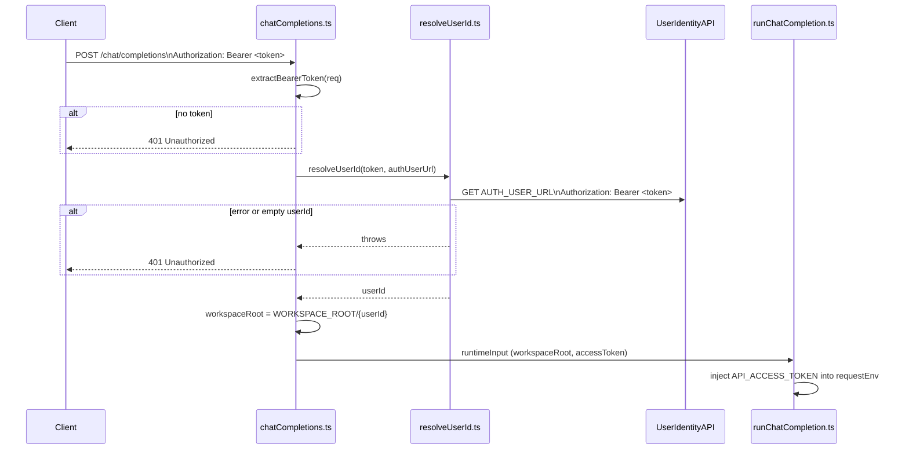

# Plan: Multi-User Support in Chat Endpoint

**Story**: `multi-user-chat`  
**Date**: 2026/05/16  
**REQ**: `.docs/reqs/2026/05/16/req-multi-user-chat.md`

## Architecture

### Request Flow

### Component Changes

| File | Change |
|---|---|
| `src/auth/resolveUserId.ts` | **New** – calls `AUTH_USER_URL` with bearer token, returns user ID string |
| `src/config/env.ts` | Add `authUserUrl?: string` to `EnvConfig` and parse `AUTH_USER_URL` |
| `src/routes/chatCompletions.ts` | Extract token from `Authorization` header; reject 401 if missing; call `resolveUserId`; set per-user `workspaceRoot`; pass `accessToken` in `runtimeInput` |
| `src/runtime/runtimeTypes.ts` | Add optional `accessToken?: string` to `RunChatCompletionInput` |
| `src/runtime/runChatCompletion.ts` | Inject `API_ACCESS_TOKEN` into `requestEnv` from `input.accessToken` before api tool init |

### User Identity API Contract

`GET {AUTH_USER_URL}` with `Authorization: Bearer <token>`.  
Expected response body: a JSON object with a top-level `id` string field  
(e.g. `{ "id": "user-123" }`). If the response status is not 2xx, the body is not valid JSON, or `id` is missing/empty, throw.

### Error Handling

- Missing `Authorization` header → 401 before calling user API.
- Non-`Bearer` scheme → 401.
- Network error / non-2xx from `AUTH_USER_URL` → 401.
- Empty or non-string `id` in response → 401.
- `AUTH_USER_URL` not configured → 401 (token present but no URL to validate against).

## Phases

### Phase 1 – Infrastructure

- [x] Inspect `src/config/env.ts`, `src/routes/chatCompletions.ts`, `src/runtime/runChatCompletion.ts`, `src/runtime/runtimeTypes.ts`, `src/auth/verifyRequest.ts`
- [x] Add `authUserUrl?: string` to `EnvConfig` and parse `AUTH_USER_URL` in `loadEnv`
- [x] Add `accessToken?: string` to `RunChatCompletionInput`

### Phase 2 – User ID Resolution

- [x] Create `src/auth/resolveUserId.ts` with `resolveUserId(token: string, authUserUrl: string): Promise<string>`
- [x] Handle HTTP errors and malformed responses; throw on failure

### Phase 3 – Chat Endpoint Integration

- [x] Add `extractBearerToken(req: Request): string | null` helper in `chatCompletions.ts`
- [x] In `createChatCompletionsHandler`: extract token, call `resolveUserId`, build per-user `workspaceRoot`, forward `accessToken` in `runtimeInput`
- [x] Inject `API_ACCESS_TOKEN` from `input.accessToken` into `requestEnv` in `runChatCompletion.ts`

### Phase 4 – Tests

- [x] Add unit test for `resolveUserId` (success, network error, non-2xx, empty id)
- [x] Add unit test for bearer token extraction logic (covered in e2e via mock identity server)
- [x] Update e2e tests to include Bearer token and mock identity server
- [x] Run validation: `npm run build` and `npm test`

### Phase 5 – Docs

- [x] Update file comment blocks in modified files
- [x] Update plan progress

## E2E Coverage

No E2E spec needed: the user-identity API is an external dependency. The critical path (token→userId→workspaceRoot) is covered by targeted unit tests.

## Notes

- `API_ACCESS_TOKEN` set in `requestEnv` will override any workspace `.env` value, which is the desired per-user override behaviour.
- `resolveUserId` must not be called if `AUTH_USER_URL` is not configured; a 401 should be returned immediately in that case.
- The user identity API response parsing accepts `{ id: string }` JSON; other shapes are rejected.
